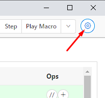
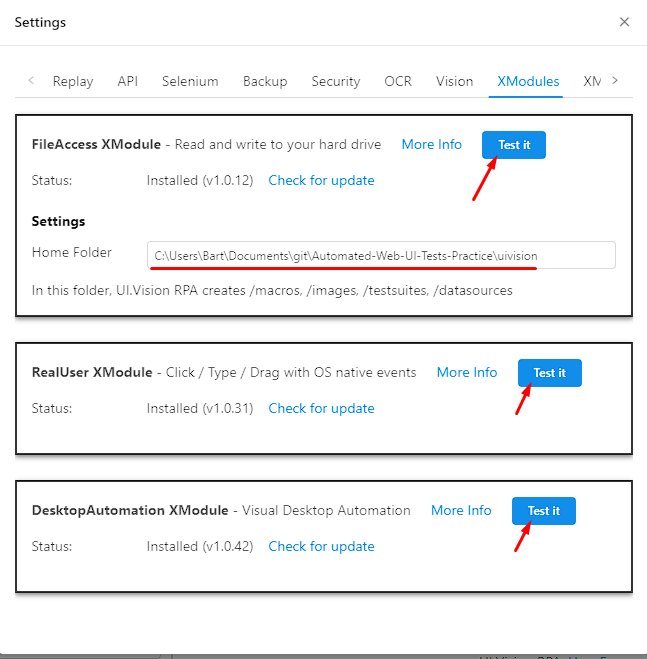
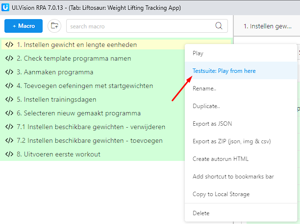

# Automated-Web-UI-Tests-Practice

A repository that contains the test scripts that I made for practicing with the UI.Vision desktop automation software.

## How to run

1. Add the [UI.Vision RPA extension](https://chrome.google.com/webstore/detail/uivision-rpa/gcbalfbdmfieckjlnblleoemohcganoc)  in Chrome.
2. Open the extension.
3. Click on settings.  

4. Install the FileAccess, RealUser and DesktopAutomation XModules and test them by clicking on `Test it` on each of them. Point the Home Folder to the `uivision` folder in this repository.  

5. Right click the first macro and click `Testsuite: Run from here`

