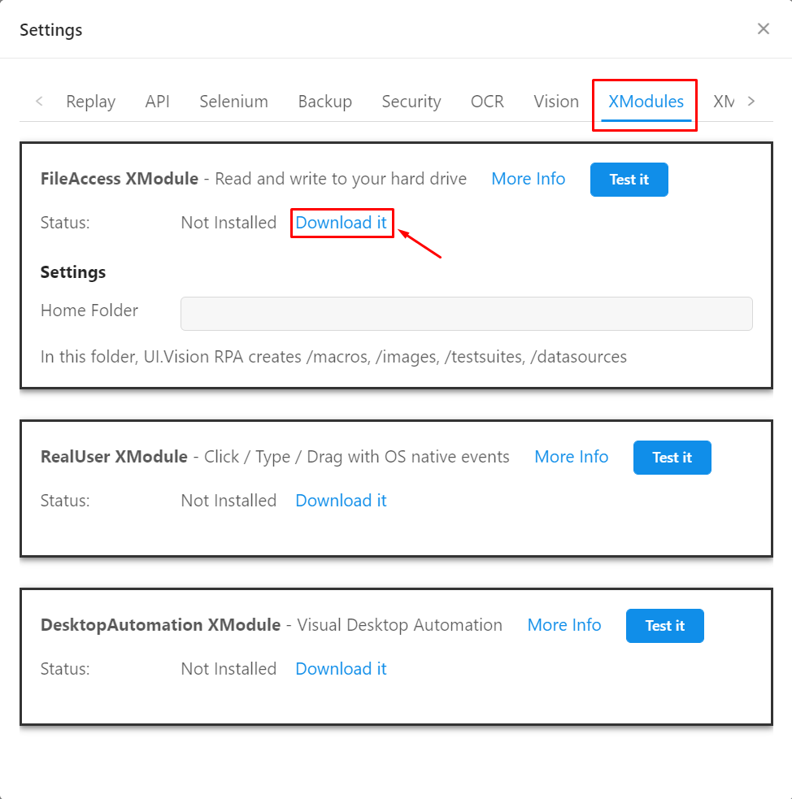
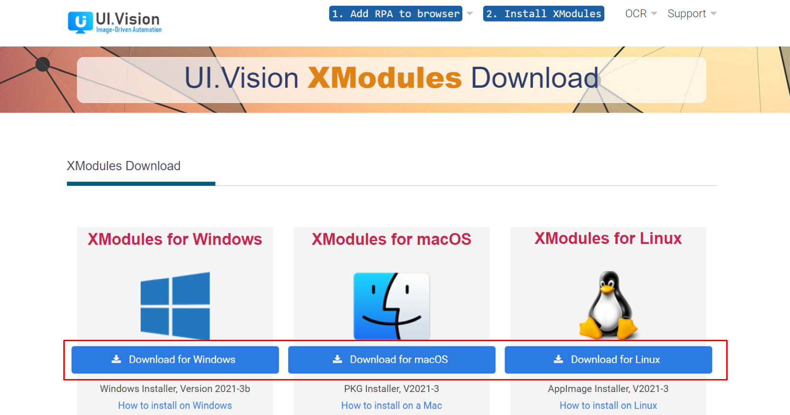
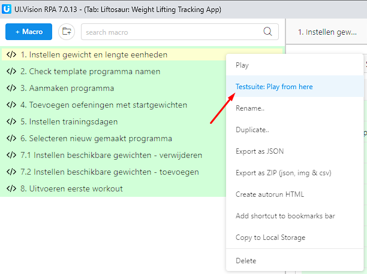

# Automated-Web-UI-Tests-Practice

A repository that contains the test scripts that I made for practicing with the UI.Vision desktop automation software.

## How to run

1. Add the [UI.Vision RPA extension](https://chrome.google.com/webstore/detail/uivision-rpa/gcbalfbdmfieckjlnblleoemohcganoc)  in Chrome.
2. Open the extension.
3. Click on settings.  

4. Install the FileAccess, RealUser and DesktopAutomation XModules by clicking on `Download it`.  

5. This opens the following webpage. Install the appropriate module for your operating system.  

6. Point the Home Folder to the `uivision` folder in this repository and test every module by clicking on each of the `Test it` buttons.  

7. Right click the first macro and click `Testsuite: Run from here`

